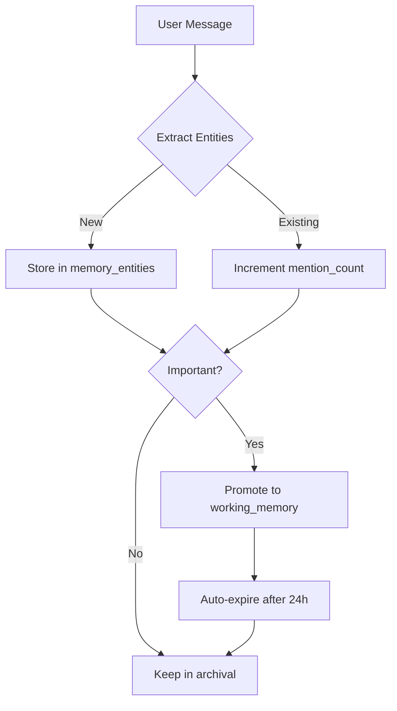

# WebMCP Agent Memory - Implementation Plan

## 🎯 Vision

Build a **persistent, browser-based memory system** for AI agents using WebMCP tools. This enables any external client (Chrome extension, Claude Desktop, etc.) to store and retrieve memories in the user's browser via PG-Lite (Postgres in browser).

---

## 📊 Architecture Overview

### Memory Tiers (Based on Memori/Letta Research)

```
┌─────────────────────────────────────────────────────────────┐
│                    CONTEXT WINDOW                           │
│  ┌──────────────────────────────────────────────────────┐  │
│  │  CORE MEMORY (Always In Context)                     │  │
│  │  - User profile, agent persona, current task         │  │
│  │  - ~500 tokens max, manually managed                 │  │
│  └──────────────────────────────────────────────────────┘  │
│                                                             │
│  ┌──────────────────────────────────────────────────────┐  │
│  │  WORKING MEMORY (Conscious Mode - Promoted)          │  │
│  │  - 5-10 essential entities                           │  │
│  │  - One-shot injection at session start               │  │
│  │  - Auto-expires after N hours                        │  │
│  └──────────────────────────────────────────────────────┘  │
│                                                             │
│  ┌──────────────────────────────────────────────────────┐  │
│  │  MESSAGE BUFFER (Recent Conversation)                │  │
│  │  - Last 20-50 messages                               │  │
│  │  - Evicted when context window full                  │  │
│  └──────────────────────────────────────────────────────┘  │
└─────────────────────────────────────────────────────────────┘

        ↕ Smart Retrieval (Auto Mode)

┌─────────────────────────────────────────────────────────────┐
│                 EXTERNAL STORAGE (PG-Lite)                  │
│                                                             │
│  ┌──────────────────────────────────────────────────────┐  │
│  │  ARCHIVAL MEMORY (Long-term)                         │  │
│  │  - Structured entities (facts, skills, preferences)  │  │
│  │  - Relationships (knowledge graph)                   │  │
│  │  - SQL-first retrieval (transparent, auditable)      │  │
│  │  - Optional embeddings for semantic search           │  │
│  └──────────────────────────────────────────────────────┘  │
│                                                             │
│  ┌──────────────────────────────────────────────────────┐  │
│  │  CONVERSATION SUMMARIES (Evicted Messages)           │  │
│  │  - Compressed history from message buffer            │  │
│  │  - Key points extraction                             │  │
│  └──────────────────────────────────────────────────────┘  │
└─────────────────────────────────────────────────────────────┘
```

---

## 🗂️ Database Schema

See [`memory-schema-proposal.ts`](./memory-schema-proposal.ts) for full implementation.

### Key Tables:

1. **`memory_blocks`** - Core memory (always in context)
2. **`conversation_messages`** - Message buffer (recent chat)
3. **`conversation_summaries`** - Compressed evicted messages
4. **`memory_entities`** - Structured long-term knowledge
5. **`memory_relationships`** - Knowledge graph connections
6. **`working_memory`** - Promoted entities (conscious mode)
7. **`memory_stats`** - Analytics & performance tracking

---

## 🔧 WebMCP Tools

See [`memory-tools-proposal.ts`](./memory-tools-proposal.ts) for full implementation.

### Tool Categories:

| Category | Tools | Purpose |
|----------|-------|---------|
| **Core Memory** | `memory_blocks_list`, `memory_block_update` | Manage always-in-context memory |
| **Entity Storage** | `memory_entity_store`, `memory_entity_search`, `memory_entity_update` | Store/retrieve structured knowledge |
| **Relationships** | `memory_relationship_create`, `memory_relationship_find` | Build knowledge graph |
| **Working Memory** | `working_memory_promote`, `working_memory_list` | Conscious mode (short-term) |
| **Conversation** | `conversation_save`, `conversation_get_recent`, `conversation_summarize` | Message buffer management |
| **Smart Retrieval** | `memory_smart_retrieve` | AI-powered context injection |
| **Analytics** | `memory_stats` | System monitoring |
| **Advanced** | `memory_raw_query` | Raw SQL access (debugging) |

---

## 🧠 Memory Modes

### 1. **Conscious Mode** (Short-term Working Memory)

**How it works:**
- At session start, analyze long-term memory
- Promote 5-10 essential entities to working memory
- One-shot injection into context
- Won't repeat during session

**What gets promoted:**
- User identity (name, role, location)
- Current projects
- Frequently mentioned topics (high `mention_count`)
- Recent context (last 24 hours)

**Implementation:**
```typescript
// Run at session start
const essentialMemories = await db
  .select()
  .from(memory_entities)
  .where(
    or(
      eq(memory_entities.category, 'person'),
      gt(memory_entities.mention_count, 5),
      gt(memory_entities.last_mentioned, new Date(Date.now() - 24 * 60 * 60 * 1000))
    )
  )
  .orderBy(desc(memory_entities.mention_count))
  .limit(10);

// Promote to working memory
for (const entity of essentialMemories) {
  await db.insert(working_memory).values({
    entity_id: entity.id,
    promotion_reason: 'frequently_mentioned',
    priority: entity.mention_count,
    expires_at: new Date(Date.now() + 24 * 60 * 60 * 1000), // 24h
  });
}
```

### 2. **Auto Mode** (Dynamic Retrieval)

**How it works:**
- On every LLM call, analyze user query
- Search memory database intelligently
- Inject 3-5 most relevant memories
- Uses scoring: recency + frequency + relevance

**Scoring algorithm:**
```typescript
const relevanceScore = (entity, query) => {
  // Recency: exponential decay
  const daysSinceLastMention = (Date.now() - entity.last_mentioned) / (1000 * 60 * 60 * 24);
  const recencyScore = Math.exp(-daysSinceLastMention / 7); // Decay over 7 days

  // Frequency: log scale (diminishing returns)
  const frequencyScore = Math.log10(entity.mention_count + 1) / 2;

  // Relevance: text similarity (simple keyword match or embeddings)
  const relevanceScore = textSimilarity(entity.name + ' ' + entity.description, query);

  // Working memory bonus
  const workingMemoryBonus = entity.in_working_memory ? 0.3 : 0;

  return (recencyScore * 0.3) + (frequencyScore * 0.2) + (relevanceScore * 0.4) + workingMemoryBonus;
};
```

### 3. **Hybrid Mode** (Recommended)

- Combine both: working memory + dynamic retrieval
- Working memory always injected (one-shot)
- Auto mode supplements with query-specific context

---

## 🚀 Implementation Phases

### Phase 1: Foundation (Week 1)
- [ ] Add memory schema to existing Drizzle setup
- [ ] Create migration for new tables
- [ ] Set up basic CRUD operations with Drizzle queries
- [ ] Add Zod validation schemas

### Phase 2: Core Tools (Week 1-2)
- [ ] Implement memory block tools
- [ ] Implement entity storage/search tools
- [ ] Add relationship tools (basic graph)
- [ ] Create conversation tools

### Phase 3: Smart Retrieval (Week 2)
- [ ] Build scoring algorithm (recency, frequency, relevance)
- [ ] Implement conscious mode (working memory promotion)
- [ ] Implement auto mode (dynamic retrieval)
- [ ] Add hybrid mode

### Phase 4: Optimization (Week 3)
- [ ] Add optional embeddings (only if needed)
- [ ] Implement message buffer eviction & summarization
- [ ] Add memory statistics & analytics
- [ ] Performance tuning (indexes, caching)

### Phase 5: UI & UX (Week 3-4)
- [ ] Memory browser/viewer UI component
- [ ] Visual knowledge graph (relationships)
- [ ] Memory settings (enable/disable modes)
- [ ] Debug panel for developers

### Phase 6: Polish (Week 4)
- [ ] Documentation & examples
- [ ] Demo use cases (travel planner, personal assistant, etc.)
- [ ] Security review (SQL injection prevention)
- [ ] Export/import memory (portability)

---

## 🎨 UI Components Needed

### 1. Memory Browser
```tsx
<MemoryBrowser>
  <Tabs>
    <Tab name="Entities">
      <EntityList categories={['fact', 'skill', 'preference', ...]} />
    </Tab>
    <Tab name="Working Memory">
      <WorkingMemoryList />
    </Tab>
    <Tab name="Knowledge Graph">
      <RelationshipGraph />
    </Tab>
    <Tab name="Conversations">
      <ConversationHistory />
    </Tab>
  </Tabs>
</MemoryBrowser>
```

### 2. Memory Card
```tsx
<MemoryEntityCard entity={entity}>
  <Badge>{entity.category}</Badge>
  <h3>{entity.name}</h3>
  <p>{entity.description}</p>
  <MetaInfo>
    Confidence: {entity.confidence}%
    Mentioned: {entity.mention_count} times
    Last seen: {formatDate(entity.last_mentioned)}
  </MetaInfo>
  <Actions>
    <Button onClick={promoteToWorkingMemory}>Promote</Button>
    <Button onClick={editEntity}>Edit</Button>
  </Actions>
</MemoryEntityCard>
```

### 3. Knowledge Graph Visualization
```tsx
// Use react-force-graph or similar
<ForceGraph3D
  graphData={{
    nodes: entities.map(e => ({ id: e.id, name: e.name, category: e.category })),
    links: relationships.map(r => ({
      source: r.from_entity_id,
      target: r.to_entity_id,
      type: r.relationship_type,
      strength: r.strength
    }))
  }}
/>
```

---

## 🔍 Retrieval Strategies

### SQL-First (Primary)

**Pros:**
- Transparent, auditable
- Fast with proper indexes
- No embedding costs
- Easy to debug

**Use for:**
- Exact match search
- Categorical filtering
- Recency/frequency sorting
- Structured queries

**Example:**
```sql
SELECT * FROM memory_entities
WHERE
  (name ILIKE '%python%' OR description ILIKE '%python%')
  AND category = 'skill'
ORDER BY
  mention_count DESC,
  last_mentioned DESC
LIMIT 5;
```

### Semantic Search (Optional)

**Pros:**
- Understands meaning, not just keywords
- Better for natural language queries
- Can find related concepts

**Cons:**
- Requires embeddings (storage + compute)
- Slightly slower
- Less transparent

**Use for:**
- Complex natural language queries
- Concept similarity ("find memories related to web development")
- When SQL returns no results

**Example:**
```sql
-- Requires pgvector extension
SELECT *, (embedding <=> $1::vector) AS distance
FROM memory_entities
ORDER BY embedding <=> $1::vector
LIMIT 5;
```

### Hybrid (Recommended)

1. Try SQL first (fast, cheap)
2. If < 3 results, supplement with semantic search
3. Merge & re-rank by combined score

---

## 📝 Best Practices

### 1. Memory Lifecycle



### 2. Context Window Management

- **Core Memory**: Max 500 tokens (3-5 blocks)
- **Working Memory**: Max 1000 tokens (5-10 entities)
- **Message Buffer**: Last 20-50 messages (~2000-5000 tokens)
- **Auto-retrieved**: 3-5 entities (~500-1000 tokens)

**Total context budget**: ~4000-7000 tokens for memory

### 3. Entity Extraction

Use structured extraction to avoid text dumps:

```typescript
// Bad: storing raw conversation
await db.insert(memory_entities).values({
  category: 'context',
  name: 'conversation',
  description: 'User said: I love Python and FastAPI...',
});

// Good: structured extraction
await db.insert(memory_entities).values({
  category: 'preference',
  name: 'Python programming',
  description: 'User loves Python and FastAPI framework',
  confidence: 95,
});

await db.insert(memory_relationships).values({
  from_entity_id: pythonId,
  to_entity_id: fastapiId,
  relationship_type: 'uses',
  strength: 8,
});
```

### 4. Privacy & Security

- **No PII in memory blocks** - Use entity references
- **Client-side encryption** - Optional for sensitive data
- **Export/delete all data** - GDPR compliance
- **SQL injection prevention** - Use parameterized queries

```typescript
// Bad: SQL injection risk
const query = `SELECT * FROM memory_entities WHERE name = '${userInput}'`;

// Good: parameterized
const result = await db
  .select()
  .from(memory_entities)
  .where(eq(memory_entities.name, userInput));
```

---

## 🧪 Testing Strategy

### Unit Tests
- [ ] Schema validation (Zod)
- [ ] CRUD operations
- [ ] Scoring algorithms
- [ ] Retrieval logic

### Integration Tests
- [ ] Tool execution via WebMCP
- [ ] Message buffer eviction
- [ ] Working memory promotion
- [ ] Graph traversal

### E2E Tests
- [ ] External client (Chrome extension) → WebMCP → Memory
- [ ] Multi-session memory persistence
- [ ] Memory export/import

---

## 📊 Success Metrics

### Memory Quality
- **Precision**: Relevant memories retrieved / Total retrieved
- **Recall**: Relevant memories retrieved / Total relevant
- **Freshness**: Avg age of working memory entities

### Performance
- **Retrieval latency**: < 100ms for SQL, < 500ms for semantic
- **Storage efficiency**: Avg tokens per entity < 200
- **Context usage**: Memory uses < 50% of context window

### User Experience
- **Agent coherence**: Does agent remember previous conversations?
- **Personalization**: Does agent adapt to user preferences?
- **Transparency**: Can user inspect/edit memories?

---

## 🔮 Future Enhancements

### Sleep-time Processing
- Background agent analyzes memory patterns
- Reorganizes working memory during idle time
- Merges duplicate entities, strengthens relationships

### Multi-modal Memory
- Store images, code snippets, links
- Visual memory browser
- Annotated screenshots

### Federated Memory
- Sync memory across devices
- Shared memory pools (team workspaces)
- Privacy-preserving sync (end-to-end encryption)

### Advanced Graph Features
- Temporal graphs (relationships over time)
- Weighted path finding (how concepts connect)
- Community detection (topic clustering)

---

## 📚 References

- [Memori Documentation](https://docs.gibsonai.app/memori) - SQL-first memory
- [Letta Memory Guide](https://docs.letta.com/memory/overview) - Memory architecture
- [MemGPT Paper](https://arxiv.org/abs/2310.08560) - Operating system approach
- [Atomic Agents Context Providers](https://atomic-agents.io/context-providers/) - Dynamic context

---

## 🎯 Next Steps

1. **Review this plan** with the team
2. **Brainstorm edge cases** (What if memory fills up? How to handle conflicts?)
3. **Decide on embeddings** (Yes/No? Which model?)
4. **Start Phase 1** - Schema implementation
5. **Build MVP** - Basic store/retrieve, then iterate

---

## Questions to Consider

1. **Embeddings**: Use OpenAI API (costs money) or local model (slower)?
2. **Storage limits**: Max entities per user? Auto-prune old memories?
3. **Multi-agent**: How to handle multiple agents sharing memory?
4. **Real-time sync**: WebSocket updates when memory changes?
5. **Versioning**: Track memory evolution over time?

Let's discuss! 🚀
